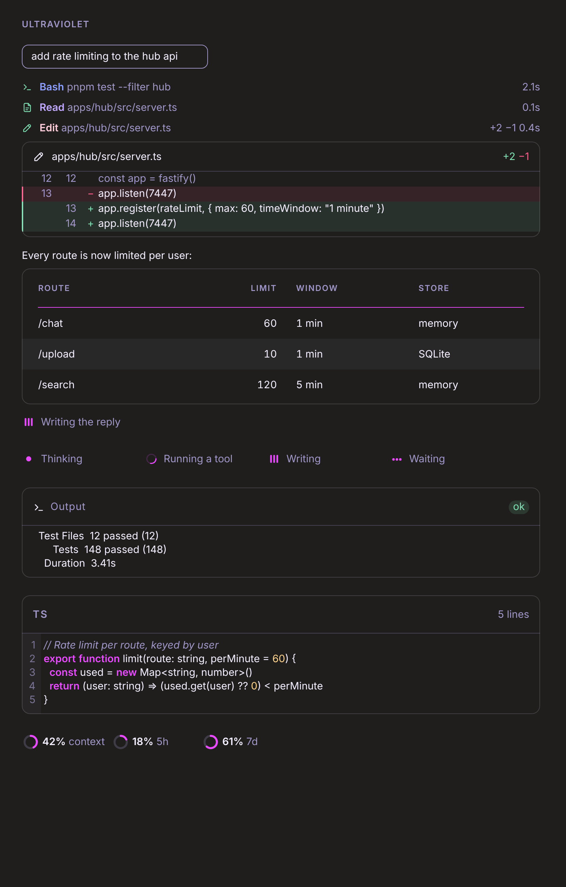

# Ultraviolet

A custom skin for the [claude-skins](https://github.com/hellosverre/claude-skins) mod, built from this palette:
`#E84BFF` `#C0A8FF` `#10288C` `#FFCDDA` `#4B0090`.



The preview is drawn by the mod's own card code with this palette, on the desktop app's dark background.

| Slot | Colour | From the palette |
|---|---|---|
| Accent (rail, prompt marker, spinner, rings) | `#e84bff` | magenta, as is |
| Read | `#c0a8ff` | lavender, as is |
| Edit / Write | `#ffcdda` | pink, as is |
| Bash | `#8c9eff` | navy, lifted so it reads on dark |
| Search | `#b07cff` | indigo, lifted so it reads on dark |
| Table header band | `#151c42` | navy, darkened to a quiet band |
| Zebra rows | `#1a1230` | indigo, darkened to a quiet band |

Every text colour clears 4.5:1 contrast on a dark background.

## Install

1. In a local session in the Claude desktop app's Code tab, install the skins mod:

   ```
   /plugin marketplace add hellosverre/claude-skins
   /plugin install skins@hellosverre-mods
   ```

2. Start a new session, then paste:

   > Use the skins `design` tool to save and apply this skin exactly: (contents of `skin.json`)

3. `/skin ultraviolet` switches back to it any time; `/skin` opens the settings to fine-tune.
